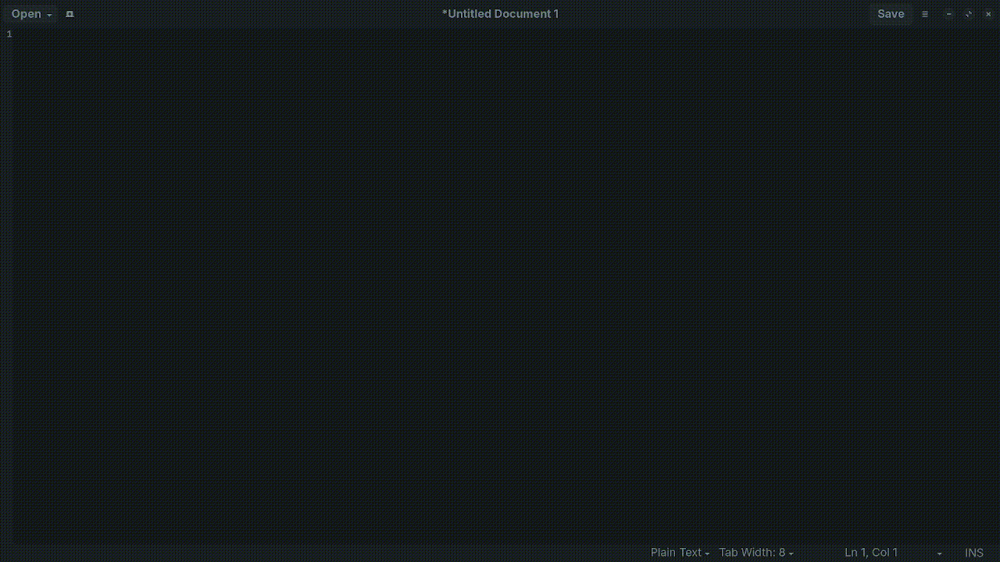

## What  is This?

Are you tired of typing a whole novel in English only to realize you're on the Arabic layout? This extension is your new best friend! It swaps your text back from the wrong keyboard layout to the right one like magic. But remember, it's only for **Arabic** and **English** lovers, sorry not sorry.

## Preview


## How to Use This ?
### Installation
1. **Download**: Get the zip from [here](https://github.com/MahmoudAdelbghany/keyboardlayoutfixer/releases/download/V1.0.0/keyboardlayoutfixer@mahmoud.a.rageh@gmail.com.shell-extension.zip).
2. **Install**: Navigate to your download directory and run:
   
```shell
gnome-extensions install --force keyboardlayoutfixer@mahmoud.a.rageh@gmail.com.shell-extension.zip
```
   
  
### Usage
- **Default Shortcut**: The default shortcut to activate the layout fix is `Super (Win key) + K`. 
- **Adjust Shortcut**: You can change this in the GNOME Extensions app .

## TODO 
- **Clean Up the Code**: Right now, it's more spaghetti than my nonna's kitchen. It's my first thing with JS, so if you see it, don't laugh too hard. (Code was done in 2 hours, okay?)
- **More Languages**: If anyone other than me ever sees this repo and you're not Arabic or English, sorry, your language isn't on the VIP list yet. But hey, if you use it, maybe we'll add more.
- **Punctuation Check**: Currently, it doesn't tell if it's real punctuation or just mistyped and needs replacement. We need to teach this extension the difference between a purposeful period and a stray dot.

## Known Bugs 
- Subtitles in settings  doesn’t update  after a new shortcut.

## Contribute
If you can read this and you're not crying over the code, maybe you can help? Contributions are welcome.

## License
Do whatever, just don't blame me if your computer starts speaking in tongues.

## Disclaimer
This extension might make your life easier, but it won't make coffee or do your laundry. Use at your own risk. 

---

**Happy Typing, Keyboard Warriors!**
